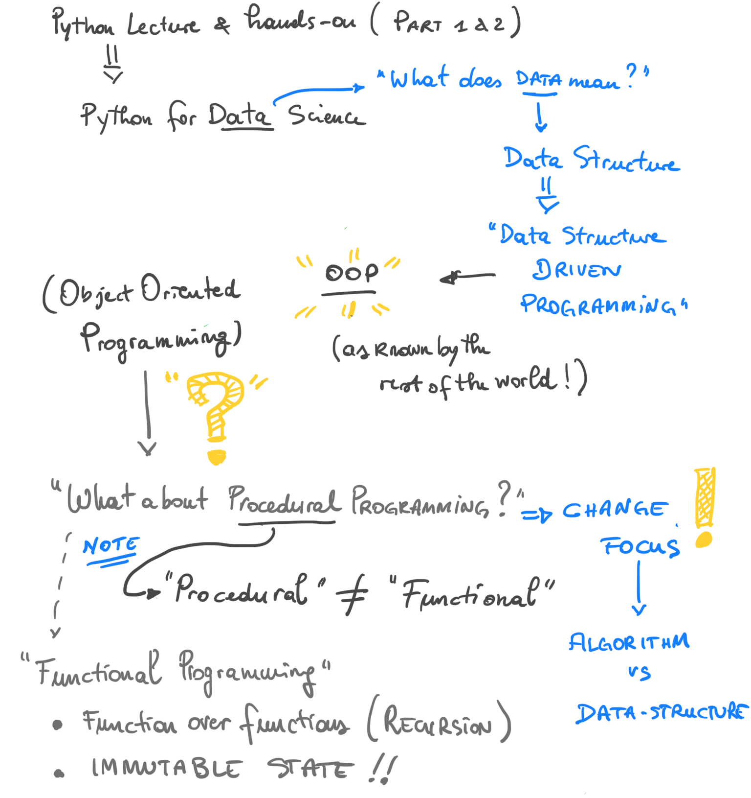

# Python Programming for Data Science @ WebValley Online 2020

This is a concise **Python 3** programming tutorial, aimed at researchers and practitioners with no prior programming experience, as well as people with previous programming skills who just want to learn Python.

I try to show everything with simple code
examples; there are no long and complicated explanations with fancy
words. 

This tutorial is composed in a basic part, aimed at people with no programming 
experience at all or very little programming experience, 
and an advance one for people who want to learn more about python. 

If you have programmed a lot in
the past using some other language you may want to read 
[the official tutorial](https://docs.python.org/3/tutorial/) also.

You can use Python 3.6 or any newer Python with this tutorial. 
**Don't use Python 2.** 

If you write a Python 2 program now someone will need to
convert it to Python 3 later, so it's best to just write Python 3 to
begin with. 

Python 3 code will work just fine in Python 4, so you don't
need to worry about that. Python 2 also has horrible
[Unicode](http://www.unicode.org/standard/WhatIsUnicode.html) problems,
so it's difficult to write Python 2 code that works correctly with
non-English characters (like π and ♫).

### Why Python Programming for _Data Science_ ?

Python is nowadays considered as "the" language of choice for Data Science. There are many reasons for that, and many articles have been written on the subject. This [article](https://analyticsindiamag.com/heres-why-python-continues-to-be-the-language-of-choice-for-data-scientists/) looks like a good and clear example on the topic.

* `Q:` _Yes, ok.. but.. is this a tutorial on Data Science?_
* `A:` **No**. This is a **tutorial** on Python programming. The perspective though is of a _wanna-be_ data scientists. 

_I know it may sounds confusing_, therefore I quickly sketched what I had in mind for this tutorial to clarify ;-)

_ Hope this mind-map look-alike clarifies a bit the perspective I chose when I thought about this course. _

`tl,dr;` Python language features will be analysed and explained from the perspective of the **Data** (and so its **Data Structures**). 

Python allows for _a lot_ of flexibility, and this flexibility will be our [swiss-knife](https://www.ctotech.io/blog/python/why-python3-insights-in-the-swiss-army-knife-of-coding/).

For example, Python supports multiple programming paradigms at once. However, our main focuss will be **data-structure oriented** (a.k.a. Object Oriented), with a splash of mixed procedural and functional [*1*] programming too.

---

`1`: functional programming only for the intrepid programmers of you :) See this [video](https://www.youtube.com/watch?v=ThS4juptJjQ)

# Content at a first glance

The tutorial consists of three main parts:

### Introduction (`intro` folder)

This part will introduce to the concept of computer programming, and to the 
very basics of the Python programming language:

1. [The Way of the Program](intro/1-the-way-of-the-program.html)
2. [Variables, Statements and Expressions](intro/2-variables-statements-expressions.html)
3. [Introduction to Functions](intro/3-intro-functions.html)
4. [Setting up an editor](intro/4-setup-editor.html)
5. [Conditional Statements](basics/5-conditionals.html)

Regardless you have already programmed before, using or not Python, 
I would suggest to take a look at this introductory section anyway. 
There is always time to **skip**, and you decide your learning pace.

**Alternatively**, a good starting point would be this online course: [Intro to Python by Microsoft](https://docs.microsoft.com/en-us/learn/modules/intro-to-python/)

### Part I: Data Structures (`part one` folder)

This section will get you started with basic Python code and data 
structures.

1. [Pythonic Functions](part_one/1-functions.ipynb)
2. [Collections and Sequences](part_one/2-collections.ipynb)
3. [Dictionaries](part_one/3-dictionaries.ipynb)
4. [Iterators, Generators, Comprehensions](part_one/4-iterators.ipynb)

### Part II: Classes and OOP (`part two` folder)

1. [Classes and OOP](part_two/1-classes.ipynb)
2. [Modules](part_two/modules.ipynb)
2. [Python Data Model](part_two/3-data-model.ipynb)
3. [Function as Objects](part_two/4-functions-objects.ipynb)
4. [Magic Methods](part_two/5-magic.ipynb)
5. [Exceptions](part_two/6-exceptions.ipynb)
6. [(Extra) Pythonic Coding Style](part_two/extra-pep8.ipynb)

